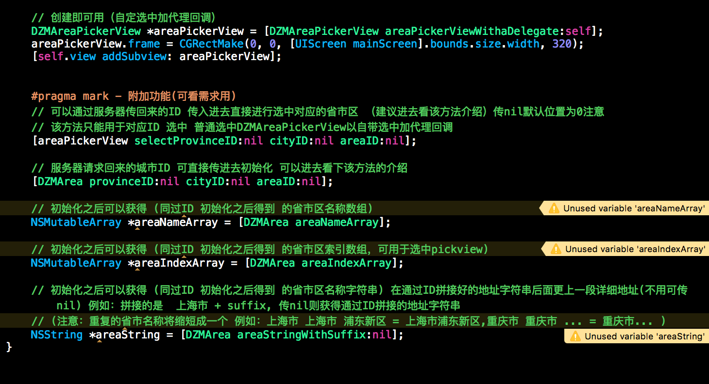

# DZMAreaPickerViewDemo
省市区封装 有省市区ID 可通过省市区ID  获取名称 选中 等操作  可支持同样格式的文本更新

##实现代码

// 创建即可用（自定选中加代理回调）
DZMAreaPickerView *areaPickerView = [DZMAreaPickerView areaPickerViewWithaDelegate:self];
areaPickerView.frame = CGRectMake(0, 0, [UIScreen mainScreen].bounds.size.width, 320);
[self.view addSubview: areaPickerView];

--------------------------------------------------------------------------------------------------------------

##功能代码图片

--------------------------------------------------------------------------------------------------------------

##期待
* 如果在使用过程中遇到BUG，希望你能Issues我，谢谢!
* 如果在使用过程中发现功能不够用，希望你能Issues我.